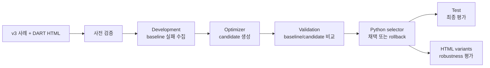

# OSSAI-26 — DART 공시 기반 LLM 답변·근거 평가

LLM이 DART 공시에서 **정답을 찾고, 실제 원문을 근거로 제시하며, 답을 확정할 수 없을 때
안전하게 보류하는지** 검증하는 로컬 평가 프로젝트다.

이 프로젝트는 HTML 파서를 생성하거나 실행하지 않는다. 로컬 DART HTML과 질문을 모델에
전달하고, 모델의 구조화된 답변을 결정론적인 Python 코드로 채점한다. 프롬프트 최적화,
다중 모델 비교, HTML 변형 기반 robustness 평가까지 하나의 재현 가능한 흐름으로 제공한다.
권장 경로는 JSONL/artifact schema v3이며, 기존 YAML/artifact schema v2도 호환 목적으로 유지한다.

## 핵심 문제

공시 질의응답에서는 숫자만 맞는 것으로 충분하지 않다. 예를 들어 모델이
`123,456백만원`을 답했다면 다음 조건을 모두 확인해야 한다.

- 답이 사람이 검토한 기대값과 일치하는가
- 인용문이 현재 HTML의 화면 표시 텍스트에 실제로 존재하는가
- 인용문 안에 모델이 답한 값이 포함되어 있는가
- 인용문이 연도·항목·연결/별도·단위 등 필수 문맥을 포함하는가

네 조건을 모두 만족한 경우만 `strict pass`로 처리한다. 따라서 우연히 숫자만 맞힌 답과
올바른 행·열 및 문맥을 찾은 답을 구분할 수 있다. 답을 확정할 수 없는 사례에서는 값을
추측하지 않고 정확한 `답변 보류` 계약을 지켜야 한다.

## 평가 설계



모델은 답 또는 프롬프트 후보만 생성한다. 점수 계산과 최종 프롬프트 선택은 항상 Python 코드가
담당한다.

| 설계 원칙 | 보장 내용 |
| --- | --- |
| 정답 비공개 | target 모델에는 질문과 HTML만 전달한다. |
| split 격리 | Development만 후보 생성, Validation만 선택, Test는 선택 후 평가에 사용한다. |
| family 격리 | 같은 공시·질문의 파생 사례가 서로 다른 split에 섞이지 않게 한다. |
| 자동 rollback | 동일 후보, 오류·보류 증가, strict pass 저하, 최소 개선 폭 미달 시 baseline을 유지한다. |
| 실제 근거 검증 | 인용이 현재 HTML에 존재하고 답과 필수 문맥을 포함하는지 검사한다. |
| 재현 가능성 | 데이터·HTML·프롬프트·채점기·Git 상태를 hash로 기록한다. |
| 로그 최소화 | 호출 로그에 전체 HTML이나 렌더링된 전체 프롬프트를 저장하지 않는다. |

### 채점 기준

Answerable 사례의 점수는 다음 네 조건으로 구성된다.

```text
0.60 × 정답 일치
+ 0.15 × 인용의 HTML 존재
+ 0.10 × 인용 안의 답 존재
+ 0.15 × 필수 문맥 포함
```

모든 조건을 만족해야 strict pass다. Unanswerable 사례는 `answer="답변 보류"`,
`abstained=true`, 빈 evidence, 보류 이유를 모두 만족해야 통과한다. 숫자 구두점, 단위, 날짜,
재무 범위는 임의로 정규화하지 않는다.

## 한계 및 질의사항

1. 점수 채점 방식에 문제가 없는지 (AI Agent 관련 지식 부족)
2. 문제풀이 및 프롬프트 개선 을 위한 AI 모델 선택의 어려움
3. 현재 HTML에서 원하는 값을 응답하는 방식에 더해, 해당 응답을 파싱하는 코드를 생성하도록 확장할 계획인데 어떤 방식으로 더해나가야할지
4. 간단한 질문은 대체로 답을 구했지만, 공시 데이터가 법인마다 작성형식이 달라 이를 이해시키는데 한계 존재

<br/>

---

<br/>

## 빠른 시작 — API 없이 전체 흐름 재현

요구 사항은 Python 3.14, `uv`, Git이다.

```bash
uv python install 3.14
uv sync --locked --dev
```

예제 데이터와 recorded provider로 외부 API 호출 없이 v3 흐름을 실행할 수 있다.

```bash
uv run --locked python scripts/validate_dataset.py \
  --cases configs/cases.v3.example.jsonl \
  --config configs/prompt-optimization.recorded.yaml

uv run --locked python scripts/optimize_dart_qa_prompt.py \
  --cases configs/cases.v3.example.jsonl \
  --config configs/prompt-optimization.recorded.yaml \
  --output reports/prompt-optimization/recorded-$(date +%Y%m%d-%H%M%S)
```

`--output`은 아직 존재하지 않는 디렉터리여야 한다. 실행 결과에는 Development 실패,
candidate prompt, Validation 비교, selected prompt, Test 결과와 요약이 포함된다.

```text
reports/prompt-optimization/<run-id>/
├── calls.jsonl
├── development.jsonl
├── candidate-prompt.md
├── validation.jsonl
├── selected-prompt.md
├── test.jsonl
└── summary.json
```

상세 실행 과정과 recorded 예제의 예상 결과는
[실행·채점 워크플로](docs/workflow.md)를 참고한다.

## 제공 기능

| 목적 | CLI | 설명 |
| --- | --- | --- |
| 데이터 사전 검증 | `scripts/validate_dataset.py` | ID, split, family, 경로, HTML hash, 기대 답·근거를 모델 호출 전에 검사 |
| 프롬프트 최적화 | `scripts/optimize_dart_qa_prompt.py` | Development → Validation 선택/rollback → Test 실행 |
| 정답 없는 사전 탐색 | `scripts/probe_dart_qa_model.py` | 기대 답 없이 모델 답·근거와 grounding만 기록 |
| 고정 프롬프트 비교 | `scripts/benchmark_fixed_prompt.py` | 같은 데이터·프롬프트·채점기로 여러 target 모델 비교 |
| HTML 변형 생성 | `scripts/generate_html_variants.py` | 근거 보존·파괴 및 교란 변형 생성, 사람 검토표 출력 |
| Robustness 평가 | `scripts/evaluate_html_robustness.py` | 보존 변형의 정답 유지와 파괴 변형의 안전 보류 확인 |
| 기존 v2 평가 | `scripts/run_workflow.py` | YAML 기반 단일 답·근거 평가 흐름 유지 |

지원 provider는 `recorded`, Gemini, NVIDIA NIM, 로컬/Cloud Ollama다. Target과 optimizer를
서로 다른 provider로 조합할 수 있다. Live 실행 전에는 `.env.example`을 복사하고 필요한 API 키를
환경변수로 설정한다.

```bash
cp .env.example .env
```

모델별 설정과 실행 예시는 [다중 모델 benchmark 가이드](docs/multi-model-benchmark-guide.md)에
정리되어 있다.

## 데이터와 산출물

v3 데이터는 한 줄에 한 사례를 담는 JSONL이다. 각 사례는 다음 정보를 가진다.

- 고유 `id`, 파생 사례를 묶는 `family_id`, `development|validation|test` split
- 프로젝트 상대 `html_path`와 `html_sha256`
- 질문과 metric·period·scope·unit metadata
- 사람이 검토한 기대 답, 허용 답, 기대 인용, 필수 문맥
- answerable/unanswerable 및 분석용 tag

실제 데이터는 작성자와 검토자를 분리해 승인한다. 데이터 준비 절차는
[`$prepare-dart-qa-data` 스킬](.agents/skills/prepare-dart-qa-data/SKILL.md)과
[검토 가이드](.agents/skills/prepare-dart-qa-data/references/review-guide.md)를 참고한다.

실행 완결성과 모델 품질은 별도로 기록한다.

| 구분 | 상태 |
| --- | --- |
| 실행 | `complete`, `partial`, `not_run` |
| 품질 | `pass`, `fail`, `inconclusive` |

API 호출이 완료되어도 답이 틀릴 수 있고, 일부 결과가 좋아 보여도 실행이 중단됐다면 전체 품질을
판단할 수 없기 때문이다.

## 프로젝트 구조

```text
src/dart_parser_workflow/   schema, provider, 실행, 채점, 선택, robustness
scripts/                    얇은 CLI 진입점
configs/                    v2/v3 사례와 provider 설정 예제
prompts/                    실행 프롬프트의 단일 원본
tests/                      offline 단위 테스트와 recorded E2E fixture
local-data/                 실제 HTML·평가 데이터, Git 제외
reports/                    실행 결과, Git 제외
```

주요 기술 스택은 Python 3.14, Pydantic, Beautiful Soup, PyYAML, pytest, Ruff, `uv`다.

## 문서 안내

- [실행·채점 워크플로](docs/workflow.md): v2/v3 내부 동작, schema, 점수와 상태
- [다중 모델 benchmark 가이드](docs/multi-model-benchmark-guide.md): 고정 프롬프트 공정 비교
- [복잡한 프롬프트 실험 가이드](docs/complex-prompt-experiment-guide.md): 후속 프롬프트 실험 설계
- [다중 공시 유형 QA 가이드](docs/multi-filing-type-qa-experiment-guide.md): 공시 유형 확장 실험
- [프로젝트 현황](docs/project-status-overview-20260828.md): 데이터셋, 실험 결과, 다음 단계
- [저장소 작업 규칙](AGENTS.md): 구현·평가 불변조건과 안전 규칙


## 개발 검사

```bash
uv run --locked ruff check .
uv run --locked pytest
```

테스트는 deterministic·offline으로 유지하며 live 모델 호출은 자동 테스트에 포함하지 않는다.
